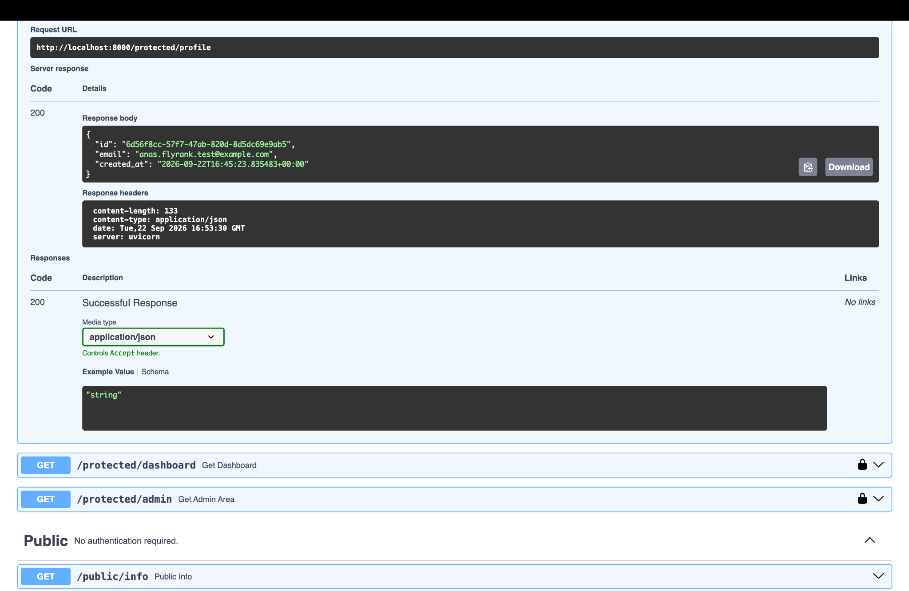
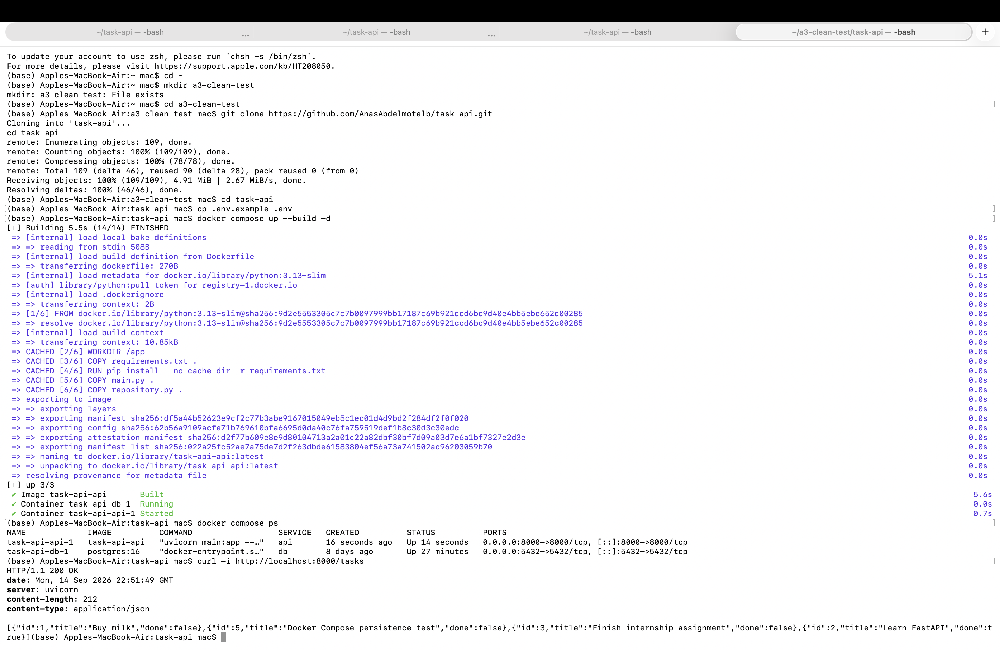

# Task API — FastAPI, PostgreSQL, Supabase Auth & Docker

A RESTful Task Management API built with **FastAPI** and **PostgreSQL**, containerized using **Docker Compose**, and secured with **Supabase Auth**.

The project was originally implemented using SQLite and was migrated to PostgreSQL as part of the **A3 assignment**. Authentication (sign up, log in, log out, and protected/admin routes backed by Supabase JWTs) was added as part of the **A4 assignment**.

## Features

- Create tasks
- Retrieve all tasks
- Retrieve a task by ID
- Update tasks
- Delete tasks
- Search tasks by title
- Filter tasks by completion status
- Task statistics
- Request validation and error handling
- PostgreSQL persistent storage
- Docker Compose support
- Interactive Swagger API documentation
- **Supabase Auth: sign up, log in, log out**
- **Bearer-token-protected routes (JWT verified against Supabase)**
- **Role-based 403 admin route, layered on top of the same auth guard**
- **Swagger "Authorize" bearer auth**

## Technology Stack

- Python
- FastAPI
- Pydantic
- PostgreSQL
- psycopg
- Supabase Auth (`supabase-py`)
- Uvicorn
- Docker
- Docker Compose

## Project Structure

```text
task-api/
├── main.py
├── auth.py
├── repository.py
├── requirements.txt
├── Dockerfile
├── compose.yaml
├── .env.example
├── .gitignore
└── README.md
```

## PostgreSQL Database

The application uses PostgreSQL for persistent task storage.

The `tasks` table contains:

| Column | Type | Description |
|---|---|---|
| `id` | SERIAL PRIMARY KEY | Unique task identifier |
| `title` | TEXT NOT NULL | Task title |
| `done` | BOOLEAN | Task completion status |

The application automatically creates the table if it does not already exist.

Example tasks are inserted when the table is empty.

## Environment Configuration

The PostgreSQL connection is configured using the `DATABASE_URL` environment variable.

Example:

```env
DATABASE_URL=postgresql://postgres:postgres@db:5432/tasks
```

Authentication is configured using Supabase environment variables:

```env
SUPABASE_URL=https://YOUR_PROJECT_REF.supabase.co
SUPABASE_KEY=YOUR_SUPABASE_ANON_KEY
ADMIN_EMAILS=admin@example.com
```

An example configuration is provided in `.env.example`.

> Real credentials and secrets should not be committed to the repository. `.env` is git-ignored.

## Setting Up Supabase Auth

1. Create a free account at [supabase.com](https://supabase.com) and create a new project.
2. In the Supabase Dashboard, open **Project Settings → API** and copy:
   - **Project URL** → `SUPABASE_URL`
   - **anon / public key** → `SUPABASE_KEY` (never use the `service_role` key here)
3. Open **Authentication → Sign In / Providers → Email** and turn **"Confirm email" OFF**, so a freshly signed-up user can log in immediately (practice-project convenience only; leave it on in production).
4. Copy `.env.example` to `.env` and fill in your real `SUPABASE_URL` and `SUPABASE_KEY`.
5. (Optional) Set `ADMIN_EMAILS` to a comma-separated list of emails allowed to call `GET /protected/admin`.

## Running with Docker Compose

Make sure **Docker Desktop** is running.

### Build and Start the Application

```bash
docker compose up --build -d
```

### Check the Containers

```bash
docker compose ps
```

The API is available at:

```text
http://localhost:8000
```

Swagger UI:

```text
http://localhost:8000/docs
```

### Stop the Containers

```bash
docker compose down
```

## API Endpoints

### Auth (Supabase)

| Method | Endpoint | Auth required | Description |
|---|---|---|---|
| POST | `/auth/signup` | None | Create a new user account |
| POST | `/auth/login` | None | Authenticate and return a JWT |
| POST | `/auth/logout` | `Authorization: Bearer <token>` | End the user's session |

### Protected / Public

| Method | Endpoint | Auth required | Description |
|---|---|---|---|
| GET | `/public/info` | None | Read public, open data |
| GET | `/protected/profile` | `Authorization: Bearer <token>` | Read the current user's safe profile data |
| GET | `/protected/dashboard` | `Authorization: Bearer <token>` | Second example route reusing the same auth guard |
| GET | `/protected/admin` | `Authorization: Bearer <token>` + admin allowlist | Admin-only route; demonstrates 403 vs 401 |

### Tasks (A1–A3)

| Method | Endpoint | Description |
|---|---|---|
| GET | `/tasks` | Retrieve all tasks |
| GET | `/tasks/{task_id}` | Retrieve a task by ID |
| POST | `/tasks` | Create a new task |
| PUT | `/tasks/{task_id}` | Update a task |
| DELETE | `/tasks/{task_id}` | Delete a task |
| GET | `/stats` | Retrieve task statistics |

## Authentication Flow

### Sign Up

```bash
curl -i -X POST http://localhost:8000/auth/signup \
  -H "Content-Type: application/json" \
  -d '{"email":"test@example.com","password":"password123"}'
```

Returns `201 Created` with the new user's `id`, `email`, and `created_at`. Missing `email`/`password` returns `400`.

### Log In

```bash
curl -i -X POST http://localhost:8000/auth/login \
  -H "Content-Type: application/json" \
  -d '{"email":"test@example.com","password":"password123"}'
```

Returns `200 OK` with `access_token`, `refresh_token`, and the user's `id`/`email`. Invalid credentials return `401` with `{"error": "Invalid login credentials"}`.

### Call a Protected Route

```bash
curl -i http://localhost:8000/protected/profile \
  -H "Authorization: Bearer <ACCESS_TOKEN_FROM_LOGIN>"
```

Returns `200 OK` with the user's `id`, `email`, and `created_at`. No token, a malformed header, or an invalid/tampered/expired token all return `401` with a JSON `error` message.

### Log Out

```bash
curl -i -X POST http://localhost:8000/auth/logout \
  -H "Authorization: Bearer <ACCESS_TOKEN_FROM_LOGIN>"
```

Returns `204 No Content`.

> **Note:** JWTs issued by Supabase are stateless — `sign_out()` clears the client-side session, but the JWT itself remains cryptographically valid until it naturally expires (Supabase's default is one hour). This is a known, expected limitation of stateless JWT auth, not a bug.

### 401 vs 403: the Admin Route

`GET /protected/admin` requires a valid token **and** an email present in `ADMIN_EMAILS`:

```bash
# No token at all
curl -i http://localhost:8000/protected/admin
# -> 401 {"error": "Access token required"}   ("I don't know who you are")

# Valid token, but not an admin
curl -i http://localhost:8000/protected/admin -H "Authorization: Bearer <TOKEN>"
# -> 403 {"error": "Admin access required"}   ("I know who you are, and no")
```

`401 Unauthorized` means authentication failed (no/invalid token). `403 Forbidden` means authentication succeeded but the authenticated user isn't allowed to perform that action.

## Swagger UI — Bearer Auth

FastAPI serves interactive docs at `http://localhost:8000/docs` with zero extra setup. Because the protected routes depend on FastAPI's `HTTPBearer` security scheme (via the shared `get_current_user` / `require_admin` dependencies in `auth.py`), Swagger automatically shows a lock icon next to every protected route and exposes an **Authorize** button:

1. Log in via `POST /auth/login` in Swagger (or curl) and copy the `access_token`.
2. Click **Authorize** at the top of `/docs`, paste the token, and confirm.
3. Use **Try it out** on `GET /protected/profile` — no manual header needed.



## Search and Filtering

### Search Tasks by Title

```http
GET /tasks?search=FastAPI
```

### Filter Completed Tasks

```http
GET /tasks?done=true
```

### Filter Pending Tasks

```http
GET /tasks?done=false
```

Search and filtering can also be combined:

```http
GET /tasks?search=FastAPI&done=true
```

## Example API Requests

### Retrieve All Tasks

```bash
curl http://localhost:8000/tasks
```
### Example Response with HTTP Headers

```text
HTTP/1.1 200 OK
server: uvicorn
content-type: application/json

[
  {"id":1,"title":"Buy milk","done":false},
  {"id":5,"title":"Docker Compose persistence test","done":false},
  {"id":3,"title":"Finish internship assignment","done":false},
  {"id":2,"title":"Learn FastAPI","done":true}
]
```
### Create a Task

```bash
curl -X POST http://localhost:8000/tasks \
  -H "Content-Type: application/json" \
  -d '{"title":"Docker Compose persistence test","done":false}'
```

### Retrieve Statistics

```bash
curl http://localhost:8000/stats
```

## Validation and Error Handling

The API provides validation and appropriate HTTP status codes.

| Scenario | HTTP Status |
|---|---|
| Invalid request data | `400 Bad Request` |
| Empty or whitespace-only title | `400 Bad Request` |
| Non-existing task | `404 Not Found` |
| Successful task creation | `201 Created` |
| Successful task deletion | `204 No Content` |
| Missing signup/login fields | `400 Bad Request` |
| Invalid login credentials | `401 Unauthorized` |
| Missing, malformed, or invalid/expired token | `401 Unauthorized` |
| Authenticated user without admin access | `403 Forbidden` |
| Successful signup | `201 Created` |
| Successful login / protected read | `200 OK` |
| Successful logout | `204 No Content` |

## PostgreSQL Persistence

PostgreSQL data is stored in a persistent Docker volume.

This allows task data to survive container restarts.

Persistence can be verified using:

```bash
docker compose down
docker compose up -d
curl http://localhost:8000/tasks
```

Previously created tasks should still be available after the containers restart.

## PostgreSQL Database Verification

The application stores task data persistently in PostgreSQL.

The following screenshot shows the `tasks` table queried directly from the PostgreSQL container:

```sql
SELECT * FROM tasks ORDER BY id;
```


The persisted records remain available after stopping and restarting the Docker Compose stack, confirming that the PostgreSQL Docker volume is working correctly.

### Inspect the Database Directly

The PostgreSQL database can be inspected directly from the database container:

```bash
docker compose exec db psql -U postgres -d tasks
```

Example SQL query:

```sql
SELECT * FROM tasks ORDER BY id;
```

Additional queries:

```sql
SELECT * FROM tasks WHERE done = TRUE;

SELECT * FROM tasks WHERE done = FALSE;

SELECT COUNT(*) AS total_tasks FROM tasks;
```

Exit PostgreSQL:

```text
\q
```

## API Documentation

FastAPI automatically provides interactive Swagger documentation.

Open:

```text
http://localhost:8000/docs
```

Swagger UI can be used to inspect and test all API endpoints.

## Clean Clone Verification

The project was tested from a fresh clone of the GitHub repository to verify that it can be reproduced from scratch.

The following steps were successfully performed:

```bash
git clone https://github.com/AnasAbdelmotelb/task-api.git
cd task-api
cp .env.example .env
docker compose up --build -d
docker compose ps
curl -i http://localhost:8000/tasks
```
The Docker Compose stack started successfully, including the FastAPI application and PostgreSQL database, and the API returned `HTTP/1.1 200 OK`.



## Git Workflow

The PostgreSQL and Docker migration was developed on the feature branch:

```text
a3-postgres-docker
```

The migration included separate commits for:

- PostgreSQL environment configuration
- Migration of the Task API from SQLite to PostgreSQL
- Docker Compose setup for FastAPI and PostgreSQL

The feature branch was merged into `main` using a GitHub Pull Request.

Supabase authentication (A4) was developed on the feature branch:

```text
a4-auth-supabase
```

with one commit per stage:

- Stage 0: setup server and supabase client
- Stage 1: signup and login routes working
- Stage 2: public route and unverified protected route
- Stage 3: profile route token verification
- Stage 4: auth middleware and logout endpoint
- Extras: 403 admin authorization case
- Stage 5: Swagger UI documentation with bearer auth
- Stage 6: publish to GitHub and write README

## Repository

GitHub Repository:

https://github.com/AnasAbdelmotelb/task-api

## Project Status

**A3 PostgreSQL Migration and Docker Compose Setup completed successfully.**
**A4 Supabase Authentication (Stages 0–6, plus the 403 admin stretch goal) completed successfully.**

The Task API now runs using:

**FastAPI + PostgreSQL + Supabase Auth + Docker Compose**

with persistent PostgreSQL task storage and JWT-protected routes.

## Author

**Anas Abdelmotelb Mansour**
