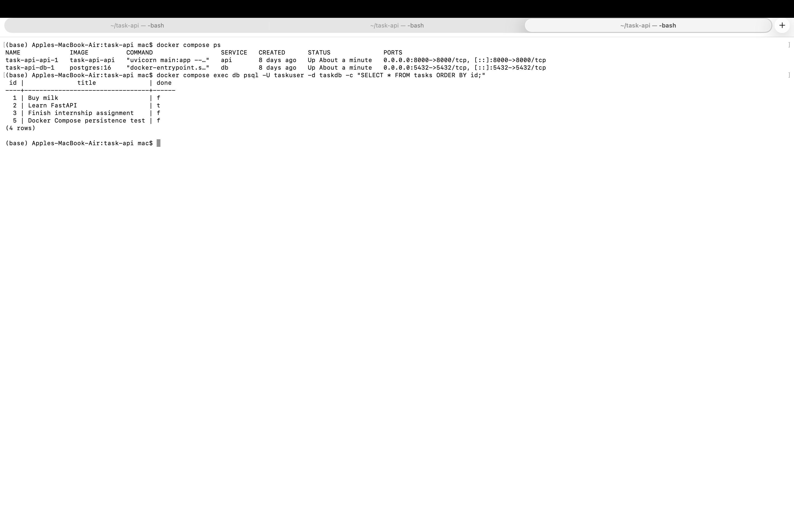

# Task API — FastAPI, PostgreSQL & Docker

A RESTful Task Management API built with **FastAPI** and **PostgreSQL**, containerized using **Docker Compose**.

The project was originally implemented using SQLite and was migrated to PostgreSQL as part of the **A3 assignment**.

## Features

- Create tasks
- Retrieve all tasks
- Retrieve a task by ID
- Update tasks
- Delete tasks
- Search tasks by title
- Filter tasks by completion status
- Task statistics
- Request validation and error handling
- PostgreSQL persistent storage
- Docker Compose support
- Interactive Swagger API documentation

## Technology Stack

- Python
- FastAPI
- Pydantic
- PostgreSQL
- psycopg
- Uvicorn
- Docker
- Docker Compose

## Project Structure

```text
task-api/
├── main.py
├── repository.py
├── requirements.txt
├── Dockerfile
├── compose.yaml
├── .env.example
├── .gitignore
└── README.md
```

## PostgreSQL Database

The application uses PostgreSQL for persistent task storage.

The `tasks` table contains:

| Column | Type | Description |
|---|---|---|
| `id` | SERIAL PRIMARY KEY | Unique task identifier |
| `title` | TEXT NOT NULL | Task title |
| `done` | BOOLEAN | Task completion status |

The application automatically creates the table if it does not already exist.

Example tasks are inserted when the table is empty.

## Environment Configuration

The PostgreSQL connection is configured using the `DATABASE_URL` environment variable.

Example:

```env
DATABASE_URL=postgresql://postgres:postgres@db:5432/tasks
```

An example configuration is provided in `.env.example`.

> Real credentials and secrets should not be committed to the repository.

## Running with Docker Compose

Make sure **Docker Desktop** is running.

### Build and Start the Application

```bash
docker compose up --build -d
```

### Check the Containers

```bash
docker compose ps
```

The API is available at:

```text
http://localhost:8000
```

Swagger UI:

```text
http://localhost:8000/docs
```

### Stop the Containers

```bash
docker compose down
```

## API Endpoints

| Method | Endpoint | Description |
|---|---|---|
| GET | `/tasks` | Retrieve all tasks |
| GET | `/tasks/{task_id}` | Retrieve a task by ID |
| POST | `/tasks` | Create a new task |
| PUT | `/tasks/{task_id}` | Update a task |
| DELETE | `/tasks/{task_id}` | Delete a task |
| GET | `/stats` | Retrieve task statistics |

## Search and Filtering

### Search Tasks by Title

```http
GET /tasks?search=FastAPI
```

### Filter Completed Tasks

```http
GET /tasks?done=true
```

### Filter Pending Tasks

```http
GET /tasks?done=false
```

Search and filtering can also be combined:

```http
GET /tasks?search=FastAPI&done=true
```

## Example API Requests

### Retrieve All Tasks

```bash
curl http://localhost:8000/tasks
```

### Create a Task

```bash
curl -X POST http://localhost:8000/tasks \
  -H "Content-Type: application/json" \
  -d '{"title":"Docker Compose persistence test","done":false}'
```

### Retrieve Statistics

```bash
curl http://localhost:8000/stats
```

## Validation and Error Handling

The API provides validation and appropriate HTTP status codes.

| Scenario | HTTP Status |
|---|---|
| Invalid request data | `400 Bad Request` |
| Empty or whitespace-only title | `400 Bad Request` |
| Non-existing task | `404 Not Found` |
| Successful task creation | `201 Created` |
| Successful task deletion | `204 No Content` |

## PostgreSQL Persistence

PostgreSQL data is stored in a persistent Docker volume.

This allows task data to survive container restarts.

Persistence can be verified using:

```bash
docker compose down
docker compose up -d
curl http://localhost:8000/tasks
```

Previously created tasks should still be available after the containers restart.

## PostgreSQL Database Verification

The application stores task data persistently in PostgreSQL.

The following screenshot shows the `tasks` table queried directly from the PostgreSQL container:

```sql
SELECT * FROM tasks ORDER BY id;
```



The persisted records remain available after stopping and restarting the Docker Compose stack, confirming that the PostgreSQL Docker volume is working correctly.

### Inspect the Database Directly

The PostgreSQL database can be inspected directly from the database container:

```bash
docker compose exec db psql -U postgres -d tasks
```

Example SQL query:

```sql
SELECT * FROM tasks ORDER BY id;
```

Additional queries:

```sql
SELECT * FROM tasks WHERE done = TRUE;

SELECT * FROM tasks WHERE done = FALSE;

SELECT COUNT(*) AS total_tasks FROM tasks;
```

Exit PostgreSQL:

```text
\q
```

## API Documentation

FastAPI automatically provides interactive Swagger documentation.

Open:

```text
http://localhost:8000/docs
```

Swagger UI can be used to inspect and test all API endpoints.

## Git Workflow

The PostgreSQL and Docker migration was developed on the feature branch:

```text
a3-postgres-docker
```

The migration included separate commits for:

- PostgreSQL environment configuration
- Migration of the Task API from SQLite to PostgreSQL
- Docker Compose setup for FastAPI and PostgreSQL

The feature branch was merged into `main` using a GitHub Pull Request.

## Repository

GitHub Repository:

https://github.com/AnasAbdelmotelb/task-api

## Project Status

**A3 PostgreSQL Migration and Docker Compose Setup completed successfully.**

The Task API now runs using:

**FastAPI + PostgreSQL + Docker Compose**

with persistent PostgreSQL task storage.

## Author

**Anas Abdelmotelb Mansour**
