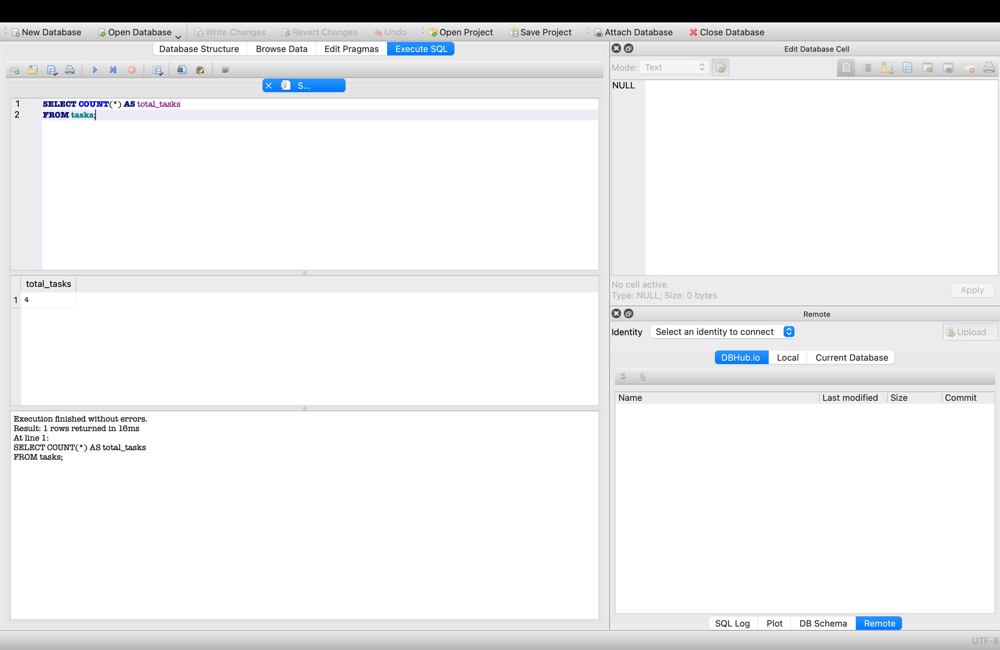

# Task API

A simple REST API built with FastAPI for managing tasks.

## Features

- Get all tasks
- Get a task by ID
- Create a new task
- Update an existing task
- Delete a task
- Health check endpoint
- Interactive Swagger documentation

## Technologies

- Python 3
- FastAPI
- Uvicorn
- Git
- GitHub

## Installation

Clone the repository:

```bash
git clone https://github.com/AnasAbdelmotelb/task-api.git
cd task-api
```

Create a virtual environment:

```bash
python3 -m venv venv
```

Activate it:

**macOS / Linux**

```bash
source venv/bin/activate
```

Install dependencies:

```bash
pip install fastapi uvicorn
```

Run the server:

```bash
uvicorn main:app --reload
```

## API Endpoints

| Method | Endpoint | Description |
|--------|----------|-------------|
| GET | `/` | API information |
| GET | `/health` | Health check |
| GET | `/tasks` | Get all tasks |
| GET | `/tasks/{task_id}` | Get a task by ID |
| POST | `/tasks` | Create a new task |
| PUT | `/tasks/{task_id}` | Update a task |
| DELETE | `/tasks/{task_id}` | Delete a task |

## SQLite Database

SQLite was chosen because it is lightweight, requires no separate database server or setup, stores the entire database in a single file, and keeps data persistent across application restarts.

The `tasks.db` file is created automatically when the application starts if it does not already exist.

The API uses SQLite for persistent task storage.

Database file:

`tasks.db`

The `tasks` table contains:

- `id` - unique task identifier
- `title` - task title
- `done` - completion status (0 = incomplete, 1 = complete)

During development, the database was inspected using DB Browser for SQLite.

Example SQL queries:

```sql
SELECT * FROM tasks;

SELECT * FROM tasks
WHERE done = 1;

SELECT * FROM tasks
WHERE done = 0;

SELECT * FROM tasks
WHERE title LIKE '%FastAPI%';

SELECT COUNT(*) AS total_tasks
FROM tasks;
```
## Database Screenshot



## API Documentation

After running the application, open:

```
http://127.0.0.1:8000/docs
```

FastAPI automatically provides interactive Swagger documentation.

## Repository

GitHub Repository:

https://github.com/AnasAbdelmotelb/task-api

## Project Status

This project was completed as part of a FastAPI REST API assignment.

GitHub Repository:
https://github.com/AnasAbdelmotelb/task-api

## Author

Anas Abdelmotelb Mansour
